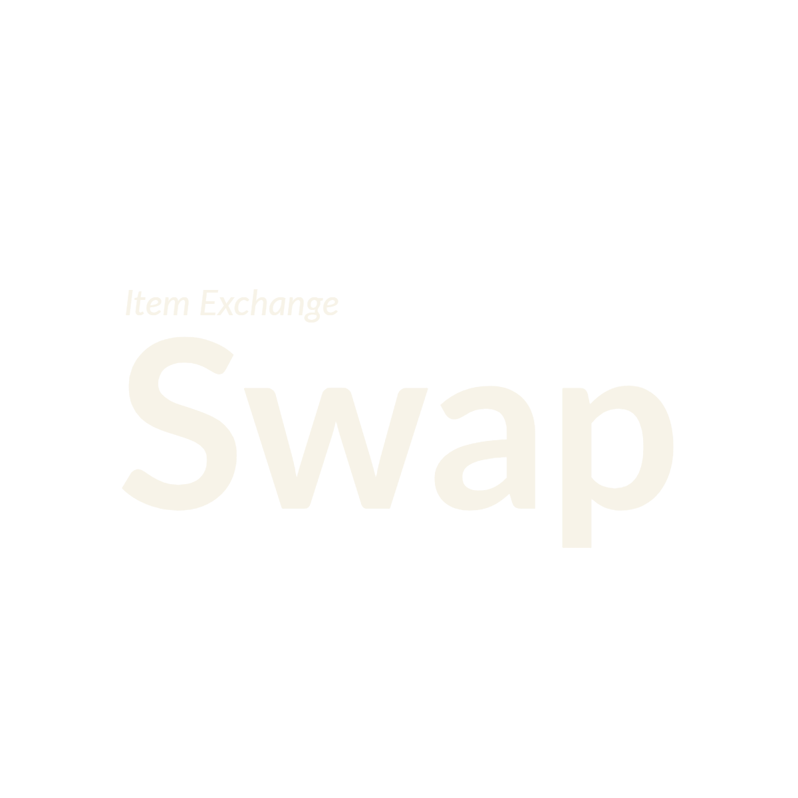
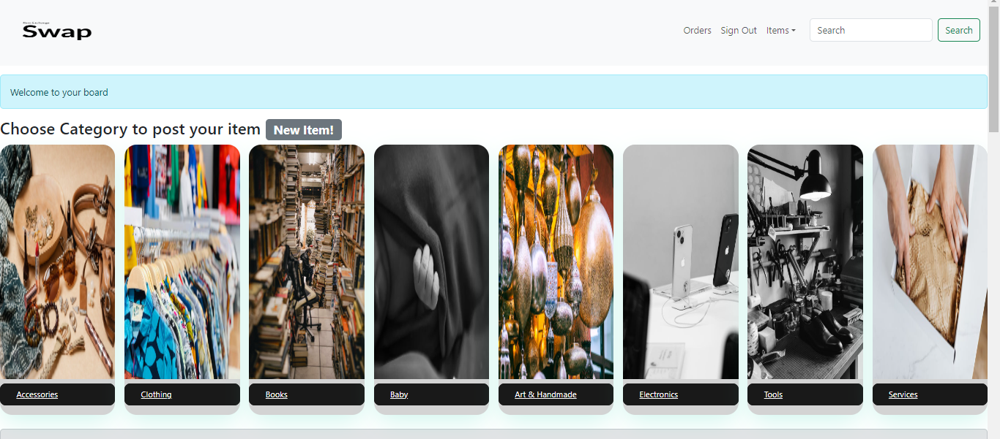
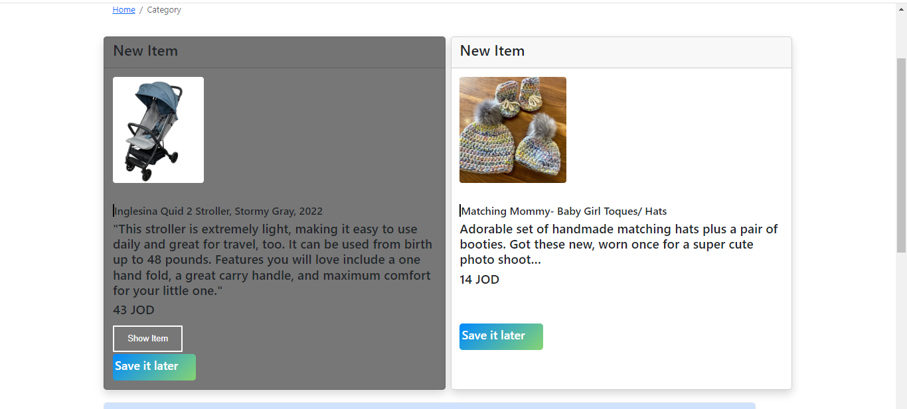
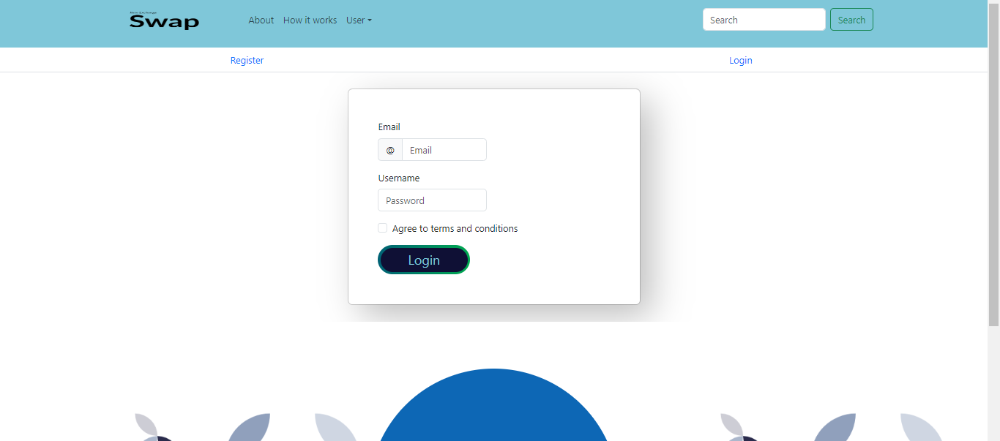
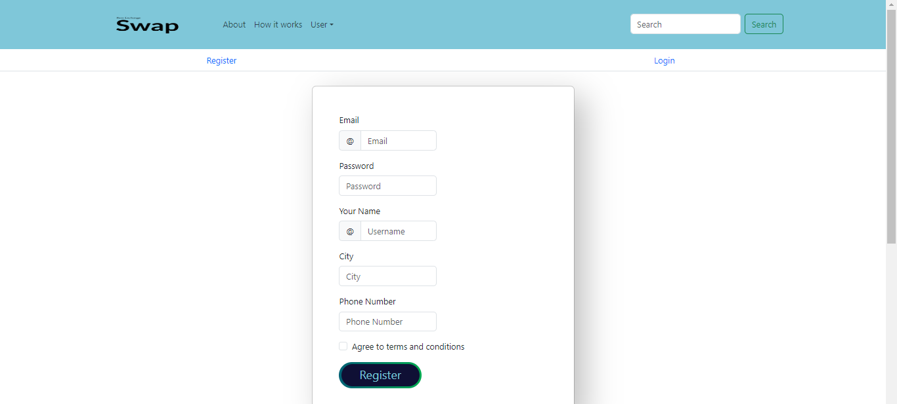
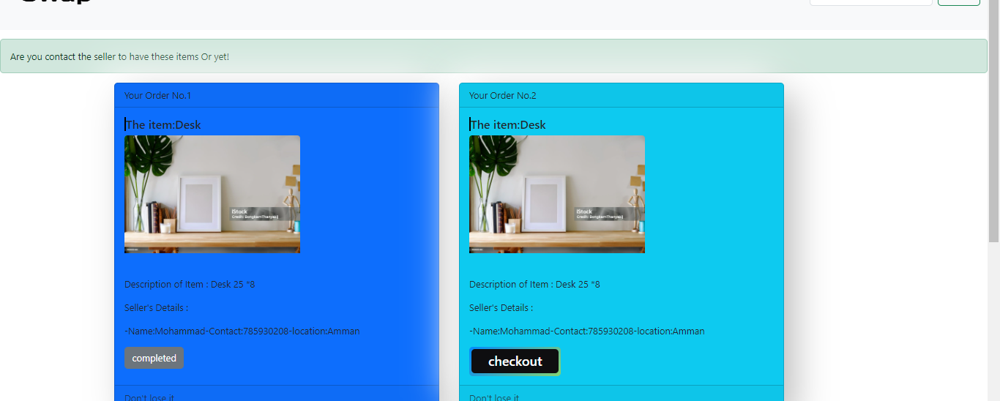

<p align="center">


 
 
</p>

<h3 align="center">SWAP
</h3>

---

<p align="center"> Item Exchange website 
    <br> 
<a href=''>Demo</a>
    <br> 
</p>

## 📝 Table of Contents

- [About](#about)
- [Getting Started](#getting_started)
- [Usage](#usage)
- [Built Using](#built_using)
- [User Story](#user_story)
- [Data Flow](#data_flow)
- [Guided By](#guided_by)

## 🧐 About <a name = "about"></a>

Through it, the user can sell his items or the products he wants to trade. He can set the price, product details, location, and contact details. You can also purchase products offered by other merchants.

You can save the product to your shopping cart to remind you of it later. You can also control or delete the product that was published. You can also create your own account.

## 🏁 Getting Started <a name = "getting_started"></a>

These instructions will get you a copy of the project up and running on your local machine for development and testing purposes.

### Prerequisites

- Visual Studio Code follow this <a href='https://code.visualstudio.com/download'>link</a> to install.
- Git Bash follow this <a href='https://www.git-scm.com/downloads'>link</a> to install.
- MongoDB follow this <a href='https://www.mongodb.com/try/download/community'>link</a> to install.

- Node.js follow this <a href='https://nodejs.org/en/download'>link</a> to install.

- Google chrome <a href='https://www.google.com.sa/intl/ar/chrome/?brand=CHBD&gclid=Cj0KCQiAtaOtBhCwARIsAN_x-3I-OtXlgHPNzJu9aEhzqYhVWzlbHrj-xFFClwalaLC6wee-ujbVccIaAjlQEALw_wcB&gclsrc=aw.ds'>link</a> to install.

### Installing:

1. Clone the repo to your local machine using git bash.

```
git clone https://github.com/your_username_/Project-Name.git
```

2. Install packeges repeat this step in backend and frontend folder

```
npm i
```

3. Run server using git bash inside backend folder

```
npm run dev
```

4. Run application using git bash inside frontend folder

```
npm run start
```

Now app ready to use


## 🎈 Usage <a name="usage"></a>

You can use SWAP through the following steps:

1.You can check the products available on the site via the home page or by entering the category options.



2.You can purchase by entering the products page and communicating directly with the publisher.




3.You can create your account on the web and log in through your account to publish the product via the following images.





4.You can save the products in your cart and confirm your purchase by clicking on the Done option.




## ⛏️ Built Using <a name = "built_using"></a>

- [MongoDB](https://www.mongodb.com/) - Database
- [Express JS](https://expressjs.com/) - Server Framework
- [React JS](https://https://reactjs.org/) - Web Framework
- [Node JS](https://nodejs.org/en/) - Server Environment

## User Story <a name = "#user_story"></a>

Trello board link
<a href='https://trello.com/b/YlHcInRS/project-4'>Trello</a>

## Data Flow <a name = "#data_flow"></a>


## ⚠️ Guided By <a name = "guided_by"></a>

This project is guided by ©️ **[MERAKI Academy](https://www.meraki-academy.org)**